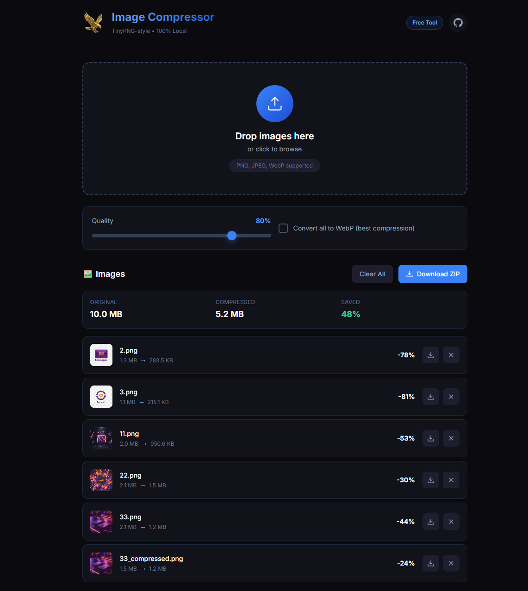

# 🦅 Elsakr Image Compressor (Web)

<div align="center">
  <a href="https://elsakr.company">
    
  </a>
</div>

> **Part of Elsakr Open Source Tools Ecosystem — [View All Tools](https://elsakr.company/tools)**  
> *Compress images IN YOUR BROWSER. No upload. No server. Complete privacy.*

---

## ⭐ Badges


## 📋 Table of Contents
- [🦅 Elsakr Image Compressor (Web)](#-elsakr-image-compressor-web)
  - [⭐ Badges](#-badges)
  - [📋 Table of Contents](#-table-of-contents)
  - [🧐 What is it?](#-what-is-it)
  - [✨ Features](#-features)
  - [🚀 Installation \& Usage](#-installation--usage)
  - [🤝 Contributing](#-contributing)
  - [📜 License](#-license)
  - [📞 Contact](#-contact)
  - [🇪🇬 Arabic Version / النسخة العربية](#-arabic-version--النسخة-العربية)

---

## 🧐 What is it?
**Elsakr Image Compressor (Web)** is a browser-based version of our compression tool. It uses modern WebAssembly/JS libraries to compress images **locally** within the user's browser. No images are ever sent to a server. Perfect for quick optimization on any device.

## ✨ Features
- **Browser-Based**: Works in Chrome, Firefox, Safari, Edge.
- **Zero Latency**: No upload/download time.
- **Secure**: Sensitive images never leave the user's computer.
- **Batching**: Compress multiple files at once.

## 🚀 Installation & Usage
Since this is a web tool:


1. **Clone**:
   ```bash
   git clone https://github.com/khalidsakrjoker/Elsakr-Image-Compressor-Web.git
   ```
2. **Open**: Simply open `index.html` in your browser.
3. **Deploy**: Upload the folder to any static host (Netlify, Vercel, GitHub Pages).

---

## 🤝 Contributing
Front-end wizards, feel free to improve the UI/UX!

## 📜 License
Distributed under the MIT License. See `LICENSE` for more information.

## 📞 Contact
**Elsakr Tools** - [elsakr.company](https://elsakr.company)  
*Open Source Tools with a Falcon’s Vision.*

---

# 🇪🇬 Arabic Version / النسخة العربية

# 🦅 Elsakr Image Compressor (نسخة الويب)

<div align="center">
  <a href="https://elsakr.company">
    
  </a>
</div>

> **جزء من نظام صقر للأدوات مفتوحة المصدر — [عرض كل الأدوات](https://elsakr.company/tools)**  
> *اضغط صورك "جوا المتصفح". مفيش رفع. مفيش سيرفر. خصوصية كاملة.*

---

## 🧐 ما هي هذه الأداة؟
نسخة الويب من أداة ضغط الصور. بتستخدم تقنيات حديثة عشان تضغط الصور **محلياً** جوا المتصفح بتاعك. مفيش أي صورة بتترفع لأي سيرفر. حل مثالي للسرعة والأمان على أي جهاز.

## ✨ المميزات
- **تعمل في المتصفح**: كروم، فايرفوكس، سفاري، إيدج.
- **سرعة خرافية**: مفيش وقت ضايع في الرفع والتحميل.
- **أمان تام**: صورك الحساسة مش بتخرج من جهازك.
- **دعم جماعي**: اضغط مجموعة صور في نفس الوقت.

## 🚀 التثبيت والاستخدام
بما إنها أداة ويب:
1. **حمل الملفات**: نزل الـ Repo.
2. **افتح**: شغل ملف `index.html` في متصفحك.
3. **انشر**: تقدر ترفع الفولدر لأي استضافة مجانية زي GitHub Pages.

## 📞 تواصل معنا
**أدوات صقر** - [elsakr.company](https://elsakr.company)  
*أدوات مفتوحة المصدر برؤية صقر.*
